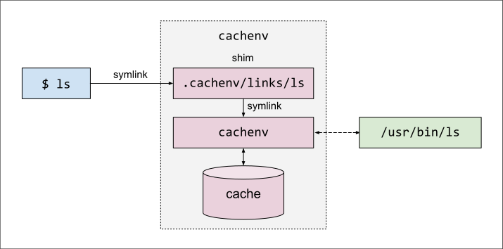

> [!WARNING]
> This project is still in early development; behavior may change without warning.
> Also only works in bash!

# cachenv
Versatile memoizing cache for program invocations, with a `virtualenv`-like
interface.

Note: this repo is still in early development; the README is aspirational.

## Overview
`cachenv` is a lightweight tool that provides caching for your commands,
scripts, and pipelines. In fact, any program that calls `exec()` can use `cachenv`.

It's like function [memoization](https://en.wikipedia.org/wiki/Memoization), but at
the process boundary. This is useful for a variety of things, especially testing,
rapid iteration, and ad hoc data processing.

The workflow mirrors that of [virtualenv](https://virtualenv.pypa.io/en/latest/):
you create an environment, activate it, and work within it.

## Use Cases
* Creating consistent, dependency-free testing environments
* Rapidly iterating on scripts or notebooks that rely on external services or data processing
* Efficiently constructing CLI pipelines that involve large inputs or expensive filters/aggregations
* Eliminating redundant calls to metered APIs

## How It Works
Just like `virtualenv`, `cachenv` inserts symlinks at the front of your `PATH`.

`cachenv` intercepts calls to cached programs and queries its cache.
The cache key is a hash of the program name and arguments.
On cache hits, cachenv replays stdout, stderr and the exit code.
On misses, the original program is executed with the provided arguments, and the
cache is updated.



## Usage
Initialize and activate a new cachenv:
```
$ cachenv init .cachenv
Created activate script at .cachenv/activate

$ source .cachenv/activate
```

Enable memoization for `ls`:
```
(.cachenv) $ cachenv add ls
Command 'ls' added to memoized commands.
Refreshed symlink for ls
```

Enjoy (?) memoization for `ls`:
```
(.cachenv) $ ls
foo

(.cachenv) $ touch bar
(.cachenv) $ ls
foo

```

Try diff mode:
```
(.cachenv) $ cachenv diff ls
0a1
> bar
```

Deactivate:
```
$ deactivate_cachenv
```
## Features
<table>
  <tr>
    <th>Implemented</th>
    <th>Feature</th>
    <th>Description</th>
  </tr>
  <tr>
    <td>✅</td>
    <td><strong>Comprehensive Caching</strong></td>
    <td>Captures stdout, stderr, and exit codes.</td>
  </tr>
  <tr>
    <td></td>
    <td><strong>Selective Memoization</strong></td>
    <td>Supports configuration to selectively enable caching based on program
        arguments and regular expressions.</td>
  </tr>
  <tr>
    <td></td>
    <td><strong>Streaming Mode</strong></td>
    <td>Supports line-level caching of stdin.</td>
  </tr>
  <tr>
    <td></td>
    <td><strong>File Awareness</strong></td>
    <td>Optionally distinguishes cache entries based on the contents of files
        provided as arguments (e.g., for <code>grep foo bar.txt</code>, refresh
        the cache when the content of <code>bar.txt</code> changes).</td>
  </tr>
  <tr>
    <td></td>
    <td><strong>Pipeline Compatibility</strong></td>
    <td>Naturally integrates with command pipelines, allowing a mix of cached and
        live executions within complex command chains. Also includes
        optimizations which can effectively cache entire pipelines.</td>
  </tr>
  <tr>
    <td>✅</td>
    <td><strong>Diff Mode</strong></td>
    <td>Show changes in a program's behavior against a cached snapshot.</td>
  </tr>
  <tr>
    <td></td>
    <td><strong>Cross-Environment Portability</strong></td>
    <td>Enables sharing and reuse of cached data across different shells and
        operating systems.</td>
  </tr>
</table>
